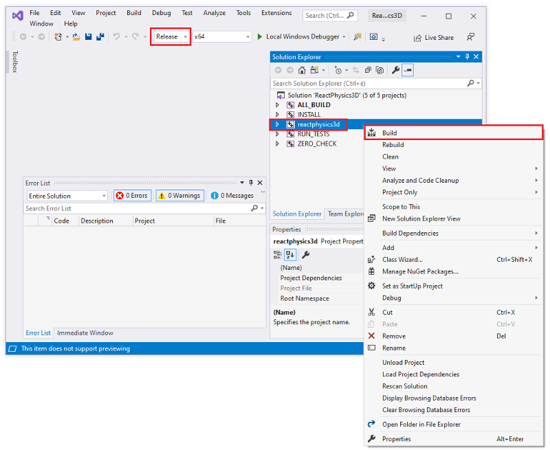
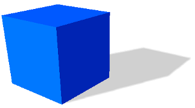
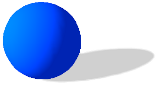
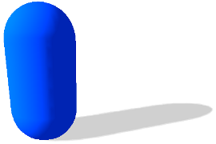
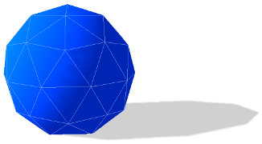

# User Documentation {#mainpage}

## Introduction {#introduction}

ReactPhysics3D is an open source C++ physics engine library that can be used
in 3D simulations and games. The library is released under the ZLib license.

## Features {#features}

   The ReactPhysics3D library has the following features:

   - Rigid body dynamics
   - Discrete collision detection
   - Collision shapes (Sphere, Box, Capsule, Convex Mesh, Static Concave Mesh, Height Field)
   - Multiple collision shapes per body
   - Broadphase collision detection (Dynamic AABB tree)
   - Narrowphase collision detection (SAT/GJK)
   - Collision response and friction (Sequential Impulses Solver)
   - Joints (Ball and Socket, Hinge, Slider, Fixed)
   - Collision filtering with categories
   - Ray casting
   - Sleeping technique for inactive bodies
   - Multi-platform (Windows, Linux, Mac OS X)
   - No external libraries (do not use STL containers)
   - Documentation (user manual and Doxygen API)
   - Testbed application with demos
   - Integrated profiler
   - Debug renderer
   - Logs
   - Unit tests

## License {#license}

The ReactPhysics3D library is released under the open-source ZLib license. For more information, read the "LICENSE" file.

## Building and installing the library {#building}

In order to build the library on your system, you first need to clone the code repository with the following command: 

~~~
    git clone https://github.com/DanielChappuis/reactphysics3d.git
~~~

Note that the *git* versioning software needs to be installed on your system. 

Then, you will need to build (compile) the library and install it on your system in order to use it in your project.
The best way is to use CMake for that. CMake will generate the necessary files on your platform (Windows, OS X or Linux) to build
the library.

CMake can be downloaded at [http://www.cmake.org](http://www.cmake.org) or using your package-management program (apt, yum, \dots) on Linux.
If you have never used CMake before, you should read [this page](http://www.cmake.org/cmake/help/runningcmake.html) as
it contains a lot of useful information. 

The remaining of this section will describe how to build and install the library with CMake. 

### Configure and generate the native tool files

Now we need to configure CMake to tell it what you want to build. Maybe you simply want to build the library in **debug** or **release**
mode or maybe you also want to build the unit tests or the testbed application with demos. At the end of this step, CMake will generate the
native build tool files on your platform that you will use to build the library. For instance, it can generate a Visual Studio solution on Windows,
a XCode project on OS X or files for the `make` command on OS X or Linux.

#### Configure and generate with the command line (Linux and Mac OS X)

First, we will see how to configure CMake and generate the native build tool files using the CMake tool with the command line.
First, you need to create a folder where you want to build the library. Then go into that folder and run the following `ccmake` command:

~~~
ccmake path\_to\_library\_source\textgreater
~~~

where `path\_to\_library\_source\textgreater` must be replaced
by the path to the the `reactphysics3d/` folder of the repository you have cloned. It is the folder that
contains the `CMakeLists.txt` file of ReactPhysics3D. Running this command will launch the CMake command line interface.
Hit the 'c' key to configure the project. There, you can also change some predefined options (see this [section](#cmakevariables) for more details)
and then, hit the 'c' key again to configure the build. Once you have set all the values as you like, you can hit the 'g' key to generate the
native build tool files in the build directory that you have created before. Finally, you can exit the CMake interface. 

#### Configure and generate using the CMake graphical interface (Linux, Mac OS X and Windows)

If your prefer, you can use the graphical user interface of CMake instead. To do this,
run the `cmake-gui` program. First, the program will ask you for the
source folder. You need to select the `reactphysics3d/` folder of the repository you have cloned. You will also have to select a
folder where you want to
build the library. Select any empty folder that is on your system. Then, you can click on **Configure**. CMake will ask you to
choose an IDE that is on your system that will be used to compile the library. For instance, you can select Visual Studio,
Qt Creator, XCode, ... Then, click on the **Finish** button. Then, you can change the compilation options. See this
[section](#cmake-options) to see what are the possible options.
Once this is done, click on **Configure** again and finally on **Generate** as you can see in the following picture. \\

Now, if you go into the folder you have chosen to build the library, you should find the native build tool files that you will use to build
the library on your platform.

### Building the library

Now, that you have generated the native build tool files on your system, you will need to build (compile) the library.

#### Building the library using **make** on the command line (Linux, Mac OS X) 

On Linux or Mac OS X, you can compile the library on the command line using the `make` command. Go into the directory where you have generated the
native build tool files and run the following command: 

~~~
make
~~~

The library will start compiling. 

#### Building the library with Visual Studio (Windows)

If you have generated the native build tool files in the previous step on Windows, you should have obtained a Visual Studio solution of ReactPhysics3D.
Now, you can open the Visual Studio solution (.sln file). Once Visual Studio is open, you first need to change the compilation mode to **Release**
at the top instead of **Debug**. Then, right click on the **reactphysics** project in the Solution
Explorer and click on **Build** in order to compile the library (see the following picture).

The library will start compiling.

### Installing the library

Now that you have compiled the library, you can install it on your system in order to put the compiled library file, the header files and the exported
CMake targets in a standard location on your system so that it can be easily imported into your project.

#### Installing the library using the `make` on the command line (Linux, Mac OS X)

On Linux or Mac OS X, you can use the `make` command to install the library. You simply need to run the following command: 

~~~
sudo make install
~~~

The library is now installed on your system. For instance, On Linux Ubuntu, the library may have been installed in the `/usr/local/lib/` folder
and the header files in the `/usr/local/include/` folder.

#### Installing the library on Windows with Visual Studio

In order to install the library on your system using Visual Studio, you need to open Visual Studio with administrator rights. This is needed in order
to have the correct rights to write the files in the `C:\Program Files (x86)\` folder on your computer for instance. To do that, type
**Visual Studio** in the Start Menu, when Visual Studio has been found, right click on it and click on **Run as administrator**. This will open
Visual Studio with administrator rights. 

Then, you need to open the Visual Studio solution (.sln file) of ReactPhysics3D that has been generated
previously with CMake. To do that, click on **File** in the top menu of Visual Studio, then on **Open** and **Project/Solution...**. Then,
you need to select the ReactPhysics3D Visual Studio solution (.sln file) on your system. Once the solution is open, you first need to change the mode
at the top to \emph{Release} instead of **Debug**. Then, right click on the **INSTALL**
project in the Solution Explorer menu and click on **Build** (see the following picture). This will install the ReactPhysics3D library in a
standard location on your system like `C:\Program Files (x86)\ReactPhysics3D\` for instance.

### CMake Options {#cmakevariables}

You can find below the different CMake options that you can set before building the library:

 - **CMAKE_BUILD_TYPE** If this variable is set to **Debug**, the library will be compiled in debugging mode.
					    This mode should be used during development stage to know where things might crash.
					    In debugging mode, the library might run a bit slow due to all the debugging information and asserts.
					    However, if this variable is set to `Release`, no debugging information is generated
					    and therefore, it will run much faster. This mode must be used when you compile the final
					    release of your application.

 - **RP3D_COMPILE_TESTBED** If this variable is **ON**, the tesbed application with demos will be compiled.
						 The testbed application uses OpenGL for rendering.
						 Take a look at this [section](#testbed) for more information about the testbed application.

 - **RP3D_COMPILE_TESTS** If this variable is **ON**, the unit tests of the library will be compiled. You will then
				     be able to launch the tests to make sure that they are running fine on your system.

 - **RP3D_PROFILING_ENABLED** If this variable is **ON**, the integrated profiler will collect data during the execution of the application.
					      This might be useful to see which part of the ReactPhysics3D
					      library takes time during its execution. This variable must be set to **OFF** when you compile
					      the final release of your application. You can find more information about the profiler in this [section](#profiler).

 - **RP3D_DOUBLE_PRECISION_ENABLED** If this variable is **ON**, the library will be compiled with double floating point precision.
							    Otherwise, the library will be compiled with single precision.

 - **RP3D_GENERATE_DOCUMENTATION** If this variable is **ON**, the library will be also generate the documentation.

## Using ReactPhysics3D in your application {#usingrp3d}

If you have built and installed the ReactPhysics3D on your system with CMake as explained in the section \ref{sec:building}, it is easy to import the
library in your project. You probably already have a `CMakeLists.txt$` file for your project. Therefore, to import the ReactPhysics3D
library, you simply need to add the following line in the `CMakeLists.txt file of your project.

~~~
find_package(ReactPhysics3D REQUIRED)
~~~

This will tell CMake to find the installed ReactPhysics3D library on your system and import the library file and headers so that you can
link it to your project. Note that if you are working on Windows or Mac OS X, you might need to use the following code in your `CMakeLists.txt file
before calling the previous function. This will help CMake to find the installed ReactPhysics3D library on Windows or Mac OS X. 

~~~
if(WIN32)
  list(APPEND CMAKE_PREFIX_PATH "C:\\Program Files (x86)\\ReactPhysics3D")
elseif(APPLE)
  list(APPEND CMAKE_PREFIX_PATH "/usr/local/lib/cmake/ReactPhysics3D")
endif()
~~~

Then, you need to tell CMake that your project (executable) depends on ReactPhysics3D with the following line in your `CMakeLists.txt` file: 

~~~
target_link_libraries(helloworld ReactPhysics3D::ReactPhysics3D)
~~~

The ReactPhyscis3D repository contains a folder with an **Hello World** project [here](https://github.com/DanielChappuis/reactphysics3d/tree/master/helloworld). In this folder, you can find a `CMakeLists.txt and a `Main.cpp` file that show how to import and use the ReactPhysics3D library in a simple project.

Here is the example `CMakeLists.txt file of the **Hello World** project:

~~~
# Minimum cmake version required
cmake_minimum_required(VERSION 3.8)

# Help CMake to find the installed library on Windows or Mac OS X
if(WIN32)
  list(APPEND CMAKE_PREFIX_PATH "C:\\Program Files (x86)\\ReactPhysics3D")
elseif(APPLE)
  list(APPEND CMAKE_PREFIX_PATH "/usr/local/lib/cmake/ReactPhysics3D")
endif()

# Import the ReactPhysics3D library 
find_package(ReactPhysics3D REQUIRED)

# Project
project(HelloWorld)

# Create the executable
add_executable(helloworld Main.cpp)

# Link with the ReactPhysics3D library
target_link_libraries(helloworld ReactPhysics3D::ReactPhysics3D)
~~~

Then in your C++ source file, you need to include the main ReactPhysics3D header file with the following line: 

~~~.cpp
// Include the main ReactPhysics3D header file
#include <reactphysics3d/reactphysics3d.h>
~~~

Also note that all the classes of the library are available in the \texttt{reactphysics3d} namespace or its shorter alias
`rp3d`. Therefore, you can use this namespace in your code with the following declaration: 

~~~.cpp
// Use the ReactPhysics3D namespace
using namespace reactphysics3d;
~~~

Here is the `Main.cpp` file of the **Hello World** project: 

~~~.cpp
// Libraries
#include <reactphysics3d/reactphysics3d.h>
#include <iostream>

// ReactPhysics3D namespace
using namespace reactphysics3d;

// Main function
int main(int argc, char** argv) {

	// First you need to create the PhysicsCommon object.
	// This is a factory module that you can use to create physics
	// world and other objects. It is also responsible for
	// logging and memory management
	PhysicsCommon physicsCommon;

	// Create a physics world
	PhysicsWorld* world = physicsCommon.createPhysicsWorld();

	// Create a rigid body in the world
	Vector3 position(0, 20, 0);
	Quaternion orientation = Quaternion::identity();
	Transform transform(position, orientation);
	RigidBody* body = world->createRigidBody(transform);

	const decimal timeStep = 1.0f / 60.0f;

	// Step the simulation a few steps
	for (int i=0; i < 20; i++) {

		world->update(timeStep);

		// Get the updated position of the body
		const Transform& transform = body->getTransform();
		const Vector3& position = transform.getPosition();

		// Display the position of the body
		std::cout << "Body Position: (" << position.x << ", " <<
		    position.y << ", " << position.z << ")" << std::endl;
	}

	return 0;
}
~~~

## The PhysicsCommon object {#physicscommon}

The first thing you need to do when you want to use ReactPhysics3D is to instantiate the `PhysicsCommon` class.
This main object will then be used as a factory to instantiate one or multiple physics worlds and other objects. This class is also
responsible for the memory management of the library. All the memory allocations are centralized into this `PhysicsCommon` object.
This class also contains the logger for the different events that can occur. 

In order to use ReactPhysics3D, you have to create an instance of the `PhysicsCommon class: 

~~~.cpp
// First you need to create the PhysicsCommon object. 
PhysicsCommon physicsCommon;
~~~

Then, you can use this object to instantiate a physics world for instance:

~~~.cpp
// Create a physics world
PhysicsWorld* world = physicsCommon.createPhysicsWorld();
~~~

When you will need to add a body into your world, you will probably need to create a collider with a given type of collision shape. 
Again, you will need to use the `PhysicsCommon` object to instantiate a collision shape as in the following example:

~~~.cpp
// Instanciate a sphere collision shape
SphereShape* sphereShape = physicsCommon.createSphereShape(radius);
~~~

As you can see, the `PhysicsCommon` object is the first thing you will need to instantiate in order to use ReactPhycsi3D in your code.

## Memory Management {#memorymanagement}

The `PhysicsCommon` class is responsible for all the memory allocations that occur in ReactPhysics3D. The base memory allocations in ReactPhysics3D
are done by default using the `std::malloc()` and `std::free()` methods. If you want to use your own behavior to allocate and free
memory, you can pass a custom memory allocator to the constructor of the `PhysicsCommon` object. You simply need to create a class
that inherits from the `MemoryAllocator` class of ReactPhysics3D and overrides the `allocate()` and `release()` methods. 

Note that the allocated memory returned by the `allocate()` method must be 16 bytes aligned. 

Note that several methods of ReactPhysics3D will create an instance of an object and return a pointer so that you can use that object. This the case
for the creation of a `PhysicsWorld` or a `RigidBody` as you can see in the following code: 

~~~.cpp
// Create a physics world
PhysicsWorld* world = physicsCommon.createPhysicsWorld();

...

// Create a rigid body
RigidBody* body = world->createRigidBody(transform);
~~~

Note that because those objects have been instantiated by ReactPhysics3D and not by you, the library is responsible to delete those objects. Therefore,
you must not call the C++ `delete` operator on those objects. There are methods that you can call to destroy those objects when you do not need
them anymore to release memory but if you don't do it, the library will do it for you when the `PhysicsCommon` object is deleted. The
following example shows how to destroy previously created `RigidBody` and `PhysicsWorld`: 

~~~.cpp
// Destroy a rigid body
world->destroyRigidBody(body);

...

// Destroy a physics world
physicsCommon.destroyPhysicsWorld(world);
~~~ 

## Physics World {#physicsworld}

Once you have created a \texttt{PhysicsCommon} object (see this [section](#physicscommon)), you will have to create a physics world. A physics world is
a place where you can add the bodies that you want to simulate. It is possible to create multiple physics worlds but you will probably never need more
than one. 

- `testOverlap()` This group of methods can be used to test whether the colliders of two bodies overlap or not. You can use this if you just want to
       know if bodies are colliding but your are not interested in the contact information. 
- `testCollision()` This group of methods will give you the collision information (contact points, normals, ...) for colliding bodies.
- `testPointInside()` This method will tell you if a 3D point is inside a `RigidBody` or `Collider`. 

The second way to use the library is to create bodies and let ReactPhysics3D animate their motions automatically using the laws of physics. This is
done by creating rigid bodies (class \texttt{RigidBody}) in your physics world and by updating the simulation by calling the 
\texttt{PhysicsWorld::update()} method each frame. The rigid bodies will move according to the forces, collision between bodies and joint constraints of
the physics world. A typical use case is a 3D real-time game for instance.

### Creating the Physics World

In order to create a physics world, you need to call the `createPhysicsWorld()` method of the main `PhysicsCommon` object: 

~~~.cpp
// Create the physics world
PhysicsWorld* world = physicsCommon.createPhysicsWorld();
~~~

This method will return a pointer to the physics world that has been created.

#### World settings

When you create a physics world as in the previous example, it will have some default settings. If you want to customize some settings, you need to
create a `PhysicsWorld::WorldSettings` object and give it in parameter when you create your physics world as in the following example: 

~~~.cpp
// Create the world settings
PhysicsWorld::WorldSettings settings;
settings.defaultVelocitySolverNbIterations = 20;
settings.isSleepingEnabled = false;
settings.gravity = Vector3(0, -9.81, 0);

// Create the physics world with your settings
PhysicsWorld* world = physicsCommon.createPhysicsWorld(settings);
~~~

The settings are copied into the world at its creation. Therefore, changing the values of your `PhysicsWorld::WorldSettings` instance after the
world creation will not have any effect. However, some methods are available to change settings after the world creation. You can take a
look at the API documentation to see what world settings can be changed in the `PhysicsWorld` class.

### Customizing the Physics World

#### Solver parameters

ReactPhysics3D uses an iterative solver to simulate the contacts and joints. For contacts, there is a unique velocity solver and for
joints there is a velocity and a position solver. By default, the number of iterations of the velocity solver is 10 and the number of iterations
for the position solver is 5. It is possible to change the number of iterations for both solvers. 

To do this, you need to use the following two methods:

~~~.cpp
// Change the number of iterations of the velocity solver
world->setNbIterationsVelocitySolver(15);

// Change the number of iterations of the position solver
world->setNbIterationsPositionSolver(8);
~~~

Increasing the number of iterations of the solvers will make the simulation more precise but also more expensive to compute. Therefore, you should change
those values only if necessary.

#### Sleeping {#sleeping}

The purpose of the sleeping technique is to deactivate resting bodies so that they are not simulated anymore. This is used to save computation
time because simulating many bodies is costly. A sleeping body (or group of sleeping bodies) is awaken as soon as another body collides with it or
a joint in which it is involed is enabled. The sleeping technique is enabled by default. You can disable it using the following method: 

~~~.cpp
// Disable the sleeping technique
world->enableSleeping(false);
~~~

Note that it is not recommended to disable the sleeping technique because the simulation might become slower. It is also possible to deactivate
the sleeping technique on a per body basis. See section \ref{sec:rigidbodysleeping} for more information. 

A body is put to sleep when its linear and angular velocity stay under a given velocity threshold for a certain amount of time
(one second by default). It is possible to change the linear and angular velocity thresholds using the two methods
`PhysicsWorld::setSleepLinearVelocity()` and `PhysicsWorld::setSleepAngularVelocity()`.  Note that the velocities must
be specified in meters per second. You can also change the amount of time (in seconds) the velocity of a body needs to stay under the
threshold to be considered sleeping. To do this, use the `PhysicsWorld::setTimeBeforeSleep()` method.

### Updating the Physics World {#updatingphysicsworld}

When the `PhysicsWorld` is used to animate the bodies through time according to the laws of physics, the world has to be updated each time you
want to simulate a step forward in time (for instance each frame in a real-time simulation).

To update the physics world, you need to use the `PhysicsWorld::update()` method. This method will perform collision detection and update the
position and orientation of the bodies according to the forces, joints constraints and collision contacts. Once you have updated the world, you will be
able to retrieve the new position and orientation of your bodies in order to render the next frame. The `PhysicsWorld::update()` method
requires a \emph{timeStep} parameter. This is the amount of time you want to advance the physics simulation (in seconds). 

The smaller the time step you pick, the more precise the simulation will be. For a real-time application, you probably want to use a time step of
at most $\frac{1}{60}$ seconds to have at least a 60 Hz framerate. Most of the time, physics engines prefer to work with a constant time step.
It means that you should always call the `PhysicsWorld::update()` method with the same time step parameter. You do not want to use the exact time
between two frames as your time step because it will not be constant. 

You can use the following technique. First, you need to choose a constant time step. Let say the time step is $\frac{1}{60}$ seconds.
Then, at each frame, you compute the time difference between the current frame and the previous one and you accumulate this difference in a variable
called **accumulator**. The accumulator is initialized to zero at the beginning of your application and is updated at each frame. The idea is to
divide the time in the accumulator in several constant time steps.  For instance, if your accumulator contains $0.145$ seconds, it means that
we can take $8$ physics steps of $\frac{1}{60}$ seconds during the current frame. Note that $0.012$ seconds will remain in the accumulator
and will probably be used in the next frame. As you can see, with this technique, multiple physics steps can be taken at each frame.
It is important to understand that each call to the `PhysicsWorld::update()` method is done using a constant time step that is
not varying with the framerate of the application. 

Here is what the code looks like at each frame: 

~~~.cpp
// Constant physics time step
const float timeStep = 1.0f / 60.0f;

// Get the current system time
long double currentFrameTime = getCurrentSystemTime();

// Compute the time difference between the two frames
long double deltaTime  = currentFrameTime - previousFrameTime;

// Update the previous time
previousFrameTime = currentFrameTime;

// Add the time difference in the accumulator
accumulator += mDeltaTime;

// While there is enough accumulated time to take
// one or several physics steps
while (accumulator >= timeStep) {

// Update the Dynamics world with a constant time step
world->update(timeStep);

// Decrease the accumulated time
accumulator -= timeStep;
}

~~~

If you want to know more about physics simulation time interpolation, you can read the nice article from Glenn Fiedler
at [https://gafferongames.com/post/fix_your_timestep](https://gafferongames.com/post/fix_your_timestep).

### Retrieving contacts

Sometimes, you might need to get the contacts information (contact point, normal, penetration depth, \dots) that occurs in your physics world. 

If you are using a physics world to only test for collisions (you never call the `PhysicsWorld::update()` method), you can retrieve contacts
information directly when you call the `PhysicsWorld::testCollision()` group of methods. Those methods take a pointer to a
`CollisionCallback` class. You simply need to create a custom class that inherits from this class and override the
`CollisionCallback::onContact()` method. When you call one of the `PhysicsWorld::testCollision()` methods, the `onContact()` method
of your class will be called with all the information about the contacts in parameters.

However, if you are using ReactPhysics3D for a real-time simulation by calling the `PhysicsWorld::update()` method each frame, you should
use the \texttt{EventListener} class to retrieve contacts as described in this [section](#receiving_feedback).

### Destroying the Physics World

When you don't need the physics world anymore, you can destroy it to release some memory. 
When the physics world is destroyed, all the bodies that have been added into it and that have not been destroyed already will
be destroyed. 

~~~.cpp
// Destroy the physics world
physicsCommon.destroyPhysicsWorld(world);
~~~

Note that the pointer to the physics world and all the objects that have been created inside it (bodies, colliders, \dots) will become invalid after
this call.

## Rigid Body {#rigidbody}

Once the physics world has been created, you can add rigid bodies into it. A rigid body is an object that can be simulated using the laws of physics.
It has a mass, a position, an orientation and one or several colliders. A rigid body can be used in different situations. It can be used to simulate a
real world object simulated by the laws of physics (it will react to forces and collisions) or moved manually (like a character).  It can also be used
to represent a static objects that is not moving in the world (like a building for instance). We can also use a rigid body that is not simulated but
there to launch a given action when colliding or overlapping with another rigid body of the world. In ReactPhysics3D, the `RigidBody` class
is used to describe a rigid body.

### Creating a Rigid Body

In order to create a rigid body, you need to specify its transform. The transform describes the initial
position and orientation of the body in the world. You need to create an instance of the `Transform` class with a vector describing the
initial position and a quaternion for the initial orientation of the body.

You have to call the `PhysicsWorld::createRigidBody()` method to create a rigid body in the world. This method will return a pointer to the
instance of the `RigidBody` object that has been created internally. You will then be able to use that pointer to get or set values to the body. 

You can see in the following code how to create a rigid body in your world: 

~~~.cpp

// Initial position and orientation of the rigid body
Vector3 position(0.0, 3.0, 0.0);
Quaternion orientation = Quaternion::identity();
Transform transform(position, orientation);

// Create a rigid body in the world
RigidBody* body = world->createRigidBody(transform);
~~~

Once your rigid body has been created in the world, you will probably want to add it one or more colliders as described in this [section](#collider).

### Type of a Rigid Body (static, kinematic or dynamic)

There are three types of bodies: **static**, **kinematic** and **dynamic**.

A **static** body has infinite mass, zero velocity but
its position can be changed manually. Moreover, a static body does not collide with other static or kinematic bodies. 

On the other side, a **kinematic** body has infinite mass, its velocity can be changed manually and its position is computed by the physics engine.
A kinematic body does not collide with other static or kinematic bodies. 

Finally, A **dynamic** body has non-zero mass, non-zero velocity determined
by forces and its position is determined by the physics engine. Moreover, a dynamic body can collide with other dynamic, static or
kinematic bodies. 

For instance, you can use a **static** body for the floor, a **kinematic** body for a moving platform and a **dynamic** body for a
rock that could fall on the floor. 

When you create a new body in the world, it is of dynamic type by default. You can change the type of the body using the `RigidBody::setType()`
method as follows:

~~~.cpp
// Change the type of the body to kinematic
body->setType(BodyType::KINEMATIC);
~~~

### Gravity

By default, all the rigid bodies with react to the gravity force of the world. If you do not want the gravity to be applied to a given body, you can disable
it using the `RigidBody::enableGravity()` method as in the following example: 

~~~.cpp
// Disable gravity for this body
rigidBody->enableGravity(false);
~~~

### Velocity Damping

Damping is the effect of reducing the velocity of the rigid body during the simulation to simulate effects like air friction for instance. By default,
no damping is applied. However, you can choose to damp the linear or/and the angular velocity of a rigid body. For instance, without angular
damping a pendulum will never come to rest. You need to use the `RigidBody::setLinearDamping()` and `RigidBody::setAngularDamping()` methods to
change the damping values. The damping value has to be positive and a value of zero means no damping at all.

### Sleeping {#rigidbodysleeping}

As described in this [section](#sleeping), the sleeping technique is used to disable the simulation of resting bodies. By default, the bodies are
allowed to sleep when they come to rest. However, if you do not want a given body to be put to sleep, you can use the
`RigidBody::setIsAllowedToSleep()` method as in the next example: 

~~~.cpp
// This rigid body cannot sleep
rigidBody->setIsAllowedToSleep(false);
~~~

### Applying Force or Torque to a Rigid Body

During the simulation, you can apply a force or a torque to a given rigid body. This force can be applied to the center of mass of the rigid body
by using the \texttt{RigidBody::\allowbreak applyForceToCenterOfMass()} method. You need to specify the force vector (in Newton) as a parameter. If
the force is applied to the center of mass, no torque will be created and only the linear motion of the body will be affected. 

~~~.cpp
// Force vector (in Newton)
Vector3 force(2.0, 0.0, 0.0);

// Apply a force to the center of the body
rigidBody->applyForceToCenterOfMass(force);
~~~

You can also apply a force to any given point in world-space using the `RigidBody::applyForceAtWorldPosition()` method or in
local-space with the `RigidBody::applyForceAtLocalPosition()` method. You need to specify the force vector (in Newton) and the point
where to apply the given force. Note that if the point is not the center of mass of the body, applying a force will generate some torque and
therefore, the angular motion of the body will be affected as well. 

~~~.cpp
// Force vector (in Newton)
Vector3 force(2.0, 0.0, 0.0);

// Point where the force is applied
Vector3 point(4.0, 5.0, 6.0);

// Apply a force to the body
rigidBody->applyForceAtLocalPosition(force, point);
~~~

It is also possible to apply a torque to a given body using the `RigidBody::applyTorque()` method. You simply need to specify
the torque vector (in Newton $\cdot$ meter) as in the following example: 

~~~.cpp
// Torque vector
Vector3 torque(0.0, 3.0, 0.0);

// Apply a torque to the body
rigidBody->applyTorque(torque);
~~~

Note that when you call the previous methods, the specified force/torque will be added to the total force/torque applied to the rigid body and that
at the end of each call to the `PhysicsWorld::update()`, the total force/torque of all the rigid bodies will be reset to zero.
Therefore, you need to call the previous methods during several frames if you want the force/torque to be applied during a certain amount of time.

### Updating a Rigid Body

When you call the `PhysicsWorld::update()` method, the bodies positions and orientations are updated to satisfy the contacts and joints
constraint between the bodies. After calling this method, you can retrieve the updated position and orientation of each body to render it.
To do that, you simply need to use the `RigidBody::getTransform()` method to get the updated transform. This transform represents the
current local-to-world-space transform of the body. 

As described in this [section](#updatingphysicsworld), at the end of a frame, there might still be some remaining time in the time accumulator.
Therefore, you should not use the updated transform directly for rendering but you need to perform some interpolation between the updated transform
and the one from the previous frame to get a smooth real-time simulation.  First, you need to compute the interpolation factor as folows: 

~~~.cpp
// Compute the time interpolation factor
float factor = accumulator / timeStep;
~~~

Then, you can use the `Transform::interpolateTransforms()` method to compute the linearly interpolated transform:  

~~~.cpp
// Compute the interpolated transform of the rigid body
Transform interpolatedTransform = Transform::interpolateTransforms(prevTransform, currTransform, factor);
~~~

The following code is the one from this [section](#updatingphysicsworld) for the physics simulation loop but with the update of a given rigid body. 

~~~.cpp

// Constant physics time step
const float timeStep = 1.0 / 60.0;

// Get the current system time
long double currentFrameTime = getCurrentSystemTime();

// Compute the time difference between the two frames
long double deltaTime  = currentFrameTime - previousFrameTime;

// Update the previous time
previousFrameTime = currentFrameTime;

// Add the time difference in the accumulator
accumulator += mDeltaTime;

// While there is enough accumulated time to take
// one or several physics steps
while (accumulator >= timeStep) {

// Update the physics world with a constant time step
physicsWorld->update(timeStep);

// Decrease the accumulated time
accumulator -= timeStep;
}

// Compute the time interpolation factor
decimal factor = accumulator / timeStep;

// Get the updated transform of the body
Transform currTransform = body->getTransform();

// Compute the interpolated transform of the rigid body
Transform interpolatedTransform = Transform::interpolateTransforms(prevTransform, currTransform, factor);

// Now you can render your body using the interpolated transform here

// Update the previous transform
prevTransform = currTranform;

~~~

If you need the array with the corresponding $4 \times 4$ OpenGL transformation matrix for rendering, you can use
the `Transform::getOpenGLMatrix()` method as in the following code: 

~~~.cpp
// Get the OpenGL matrix array of the transform
float matrix[16];
transform.getOpenGLMatrix(matrix);
~~~

A nice article to read about this time interpolation is the one from Glenn Fiedler at [https://gafferongames.com/post/fix_your_timestep](https://gafferongames.com/post/fix_your_timestep).

### Mass, Center of Mass, Inertia Tensor {#rigidbodymass}

The mass, center of mass and inertia tensor of a rigid body are important parameters for the physical simulation of a rigid body.

#### Mass

The `RigidBody` has a mass value (in kilograms) which is 1 kilogram by default. There are two ways to set the mass of a rigid body. First, you
can set it directly using the \texttt{RigidBody::setMass()} method. Secondly, it is also possible to compute this mass
automatically using the mass of the colliders of the rigid body. As described in section \ref{sec:material}, the material of each collider has a 
mass density value. This value is 1 by default. You change change the mass density value of the colliders of a rigid body and then use the
`RigidBody::updateMassFromColliders()` method to automatically compute the mass of the rigid body using the mass density and shape of
its colliders. Note that you will need to call this method again if you add another collider to the rigid body.

#### Center of mass

The center of mass of a `RigidBody` is the mean location of the distribution of mass of the body in space. By default the center of mass
of the rigid body is located at its origin. There are two ways to set the center of mass of a rigid body. First, you can set it directly using the
`RigidBody::setLocalCenterOfMass()` method. Secondly, as for the mass, the center of mass can also be computed automatically using the
mass, shape and transform of all the colliders of the rigid body. As described in section \ref{sec:material}, the material of each collider has a
mass density value. This value is 1 by default. You can set the mass density value of the colliders and then use the
`RigidBody::updateLocalCenterOfMassFromColliders()` method to automatically compute the center of mass of the rigid body.
Note that you will need to call this method again if you add another collider to the rigid body.

#### Inertia Tensor

The inertia tensor of a `RigidBody` is a $3 \times 3$ matrix describing how the mass is distributed inside the rigid body which is
used to calculate its rotation. The inertia tensor depends on the mass and the shape of the body. By default the local inertia tensor of a rigid body
is the identity matrix. There are two ways to set the inertia tensor of
a rigid body. First, you can set it directly using the `RigidBody::setLocalInertiaTensor()` method. Note that this will set the inertia tensor
of the body in local-space coordinates which is usually a diagonal matrix. This method takes a \texttt{Vector3} with the three diagonal entries of the
matrix. Secondly, the local inertia tensor can be computed automatically using the mass density, shape and transform of all the colliders of the body.
As described in section \ref{sec:material}, the material of each collider has a mass density value which is 1 by default. You can set the mass density
value of the colliders and then use the `RigidBody::updateLocalInertiaTensorFromColliders()` method to automatically compute the local inertia
tensor of the body. Note that you will need to call this method again if you add another collider to the rigid body.

Note that it is also possible to automatically compute the mass, center of mass and inertia tensor of a rigid body at the same time using the
`RigidBody::updateMassPropertiesFromColliders()`.

### Restricting linear/angular motion of a Rigid Body

It is possible to use the `RigidBody::setLinearLockAxisFactor()` method to restrict the linear motion of a rigid body along the world-space
X,Y and Z axes. For instance, the following code shows how to disable the linear motion of a rigid body along the world-space Y axis by setting the lock
factor to zero for this axis. 

~~~.cpp
// Disable motion along the Y axis
rigidBody->setLinearAxisFactor(Vector3(1, 0, 1));
~~~

In the same way, you can use the `RigidBody::setAngularLockAxisFactor()` method to restrict the angular motion of a rigid body around the
world-space X,Y and Z axes. For instance, the following code shows how to disable the angular motion of a rigid body around the world-space Y axis
by setting the lock factor to zero for this axis. 

~~~.cpp
// Disable rotation around the Y axis
rigidBody->setAngularAxisFactor(Vector3(1, 0, 1));
~~~

### Destroying a Rigid Body

It is really simple to destroy a rigid body when you don't need it anymore. You simply need to use the `PhysicsWorld::destroyRigidBody()`
method. You need to use the pointer to the body you want to destroy as a parameter. Note that after calling that method, the pointer will not be valid
anymore and therefore, you should not use it. When you destroy a rigid body that was part of a joint, that joint will be automatically destroyed as
well. 

Here is how to destroy a rigid body: 

~~~.cpp
// Here, world is an instance of the PhysicsWorld class
// and body is a RigidBody* pointer

// Destroy the rigid body
world->destroyRigidBody(body);
~~~

## Collider {#collider}

To allow bodies to collide against each others, we need `colliders`. A collider (class `Collider`) describes the collision shape
of a body. A body can have multiple colliders attached to it. When adding a collider to a body, you need to specify its collision
shape (box, sphere, capsule, \dots) and its transform relative to the origin of the body. 

Before adding a collider to a body, you need to create a collision shape. A collision shape can be instantiated by calling a method of the
main `PhysicsCommon` object. The following example shows how instantiate a collision shape (a sphere shape) from the `PhysicsCommon`
object and use it to add a new collider to a body. 

~~~.cpp
// Instantiate a sphere collision shape
float radius = 3.0f;
SphereShape* sphereShape = physicsCommon.createSphereCollisionShape(radius);

// Relative transform of the collider relative to the body origin
Transform transform = Transform::identity();

// Add the collider to the rigid body
Collider* collider;
collider = body->addCollider(&shape, transform);
~~~

Note that a given collision shape instance can be shared between multiple colliders. The next section presents the different types of collision
shapes that are available in ReactPhysics3D.

### Collision Shapes {#collisionshapes}

As we have just seen, a collision shape is used to describe the shape of a collider for collision detection. They are many types of
collision shapes that you can use. They all inherit from the `CollisionShape` class.

Note that ReactPhysics3D does not support collision between two concave shapes `ConcaveMeshShape` and `HeightFieldShape`).

#### Box Shape

The `BoxShape} class describes a box collision shape centered at the origin of the collider. The box is aligned with the shape
local X, Y and Z axis.  In order to create a box shape, you only need to specify the three half extents dimensions of the box in the three X, Y and
Z directions. 

For instance, if you want to create a box shape with dimensions of 4 meters, 6 meters and 10 meters along the X, Y and Z axis respectively, you
need to use the following code: 

~~~.cpp
// Half extents of the box in the x, y and z directions
const Vector3 halfExtents(2.0, 3.0, 5.0);

// Create the box shape
BoxShape* boxShape = phycsicsCommon.createBoxShape(halfExtents);
~~~

#### Sphere Shape

The `SphereShape` class describes a sphere collision shape centered at the origin of the collider. You only need to specify the
radius of the sphere to create it. 

For instance, if you want to create a sphere shape with a radius of 2 meters, you need to use the following code: 

~~~.cpp
// Create the sphere shape with a radius of 2m
SphereShape* sphereShape = physicsCommon.createSphereShape(2.0);
~~~

#### Capsule Shape

The `CapsuleShape` class describes a capsule collision shape around the local Y axis and centered at the origin of the collider.
It is the convex hull of two spheres. It can also be seen as an elongated sphere. In order to create it, you only need to specify the
radius of the two spheres and the height of the capsule (distance between the centers of the two spheres).  

For instance, if you want to create a capsule shape with a radius of 1 meter and the height of 2 meters, you need to use the following code: 

~~~.cpp
// Create the capsule shape
CapsuleShape* capsuleShape = physicsCommon.createCapsuleShape(1.0, 2.0);
~~~

#### Convex Mesh Shape

The `ConvexMeshShape` class can be used to describe the shape of a convex mesh centered at the origin of the collider.

In order to create a `ConvexMeshShape`, we first need to create a `ConvexMesh`. A `ConvexMesh` can be instanciated once and
used to create multiple `ConvexMeshShapes` with different scaling if necessary. There are two ways to create a `ConvexMesh`.

If you know the vertices and faces of your mesh, you can use the following method to create a `ConvexMesh`: 

~~~.cpp
PhysicsCommon::createConvexMesh(const PolygonVertexArray& polygonVertexArray, std::vector<Message>& messages)
~~~

To use this method, you need to create an array of `PolygonFace` to describe each face of your mesh. You also need to have an array with
the vertices coordinates and an array with the vertex indices of each face of you mesh. Then, you have to create a `PolygonVertexArray` with
your vertices coordinates and indices array. You also need to specify your array of `PolygonFace`. Then, you can call the previous method
to instantiate a `ConvexMesh` using your `PolygonVertexArray`. \\ 

The following example shows how to create a `ConvexMeshShape` when you know the vertices and faces of your mesh.
In this example, we create a cube as a convex mesh shape. Of course, this is only for the example. If you really need a cube collision
shape, you should use the `BoxShape` instead. \\

~~~.cpp
// Array with the vertices coordinates of the convex mesh
float vertices[24] = {-3, -3, 3,
	      3, -3, 3,
	      3, -3, -3,
	      3, -3, -3,
	      -3, 3, 3,
	      3, 3, 3,
	      3, 3, -3,
	      -3, 3, -3};

// Vertex array with all vertices of the mesh
rp3d::VertexArray vertexArray(vertices, 3 * sizeof(float),
		  24, rp3d::VertexArray::DataType::VERTEX_FLOAT_TYPE);

// Compute the convex mesh from the array of vertices
std::vector<rp3d::Message> messages;
ConvexMesh* convexMesh = physicsCommon.createConvexMesh(vertexArray, messages);

// Display the messages (info, warning and errors)
if (messages.size() > 0) {

	for (const rp3d::Message& message: messages) {

		std::string messageType;

		switch(message.type) {

			case rp3d::Message::Type::Information:
				messageType = "info";
				break;
			case rp3d::Message::Type::Warning:
				messageType = "warning";
				break;
			case rp3d::Message::Type::Error:
				messageType = "error";
				break;
		}

		std::cout << "Message (" << messageType << "): " << message.text << std::endl;
	}
}

// Make sure there was no errors during mesh creation
assert(convexMesh != nullptr);

~~~

Note that the vertex coordinates and indices array are copied into the `ConvexMesh`. Therefore, you can release the memory of the
`PolygonVertexArray` after the `ConvexMesh` creation. However, the mesh data is stored inside the `ConvexMesh`. Therefore,
you should not release it until all the `ConvexMeshShapes` that have been instantiated from it are destroyed. 

You need to make sure that the mesh you provide is indeed convex. Secondly, you should provide the simplest possible convex mesh. It means
that you need to avoid coplanar faces in your convex mesh shape. Coplanar faces have to be merged together. Remember that convex meshes are
not limited to triangular faces, you can create faces with more than three vertices. 

Also note that meshes with duplicated vertices are not supported. The number of vertices you pass to create the `PolygonVertexArray` must
be exactly the number of vertices in your convex mesh. The `PhysicsCommon::createConvexMesh()` will also report errors if some faces of your
mesh have almost zero area (degenerated face). You will need to fix those errors in order to create the `ConvexMesh`.

When you specify the vertices for each face of your convex mesh, be careful with their order. The vertices of a face must be specified in
counter clockwise order as seen from the outside of your convex mesh. 

You also need to make sure that the origin of your mesh is inside the convex mesh. A mesh with an origin outside the
convex mesh is not currently supported by the library. 

As discussed before, there is a second way to create a `ConvexMesh`. In case you only know the vertices of your
mesh (you don't know the faces), you can use the following method: 

~~~.cpp
PhysicsCommon::createConvexMesh(const VertexArray& vertexArray, std::vector<Message>& messages)
~~~

With this method, you only need to specify the array of vertices (`VertexArray`) of your mesh (not the faces). The library will use the
QuickHull algorithm to compute a convex mesh that includes all the vertices. 

~~~.cpp
// Array with the vertices coordinates of the convex mesh
float vertices[24] = {-3, -3, 3,
	      3, -3, 3,
	      3, -3, -3,
	      3, -3, -3,
	      -3, 3, 3,
	      3, 3, 3,
	      3, 3, -3,
	      -3, 3, -3};

// Vertex array with all vertices of the mesh
rp3d::VertexArray vertexArray(vertices, 3 * sizeof(float),
		  24, rp3d::VertexArray::DataType::VERTEX_FLOAT_TYPE);

// Compute the convex mesh using only the array of vertices
std::vector<rp3d::Message> messages;
ConvexMesh* convexMesh = physicsCommon.createConvexMesh(vertexArray, messages);

// Display the messages (info, warning and errors)
if (messages.size() > 0) {

	for (const rp3d::Message& message: messages) {

		std::string messageType;
		switch(message.type) {
			case rp3d::Message::Type::Information:
				messageType = "info";
				break;
			case rp3d::Message::Type::Warning:
				messageType = "warning";
				break;
			case rp3d::Message::Type::Error:
				messageType = "error";
				break;
		}

		std::cout << "Message (" << messageType << "): " << message.text << std::endl;
	}
}

// Make sure there was no errors during mesh creation
assert(convexMesh != nullptr);

~~~

Note that the `PhysicsCommon::createConvexMesh()` method takes a reference to an array of messages as parameter. If there are errors
during the convex mesh creation, the method will return `null` and the array with contain some error messages describing the issues. 

Now that we have a `ConvexMesh`, we can create a `ConvexMeshShape` as in the following example: 

~~~.cpp
// Scaling factor
Vector3 scaling(1, 1, 1);

// Create the ConvexMeshShape
ConvexMeshShape* convexMeshShape = physicsCommon.createConvexMeshShape(convexMesh, scaling);
~~~

As you can see, you can specify a scaling factor in the `PhysicsCommon::createConvexMeshShape()` method when you create a
`ConvexMeshShape`. All the vertices of your mesh will be scaled from the local origin of the mesh by this factor.
It means that you can use the same `ConvexMesh` for multiple `ConvexMeshShape` with a different scaling factor each time. 

Note that collision detection with a `ConvexMeshShape` is more expensive than with a `SphereShape` or a `CapsuleShape`.

#### Concave Mesh Shape

The `ConcaveMeshShape` class can be used for a static concave triangular mesh. It can be used to describe an environment for
instance. Note that it cannot be used with a dynamic body that is allowed to move. Moreover, make sure to use a `ConcaveMeshShape` only
when you are not able to use a convex shape and also try to limit the number of triangles of that mesh because collision detection
with `ConcaveMeshShape` is quite expensive compared to convex shapes. Note that collsions between two concave mesh shape are not supported. 

In order to create a `ConcaveMeshShape`, we first need to create a `TriangleMesh`. A `TriangleMesh` describes your
mesh made of triangles and can be reused multiple times to instantiate `ConcaveMeshShapes` with different scaling factors for instance. 
In order to create the `TriangleMesh`, we first need to instantiate a `TriangleVertexArray` describing the vertices and triangle faces
of the mesh. We then pass the `TriangleVertexArray` to the `PhysicsCommon::createTriangleMesh()` method to create the `TriangleMesh`.

When you specify the vertices for each triangle face of your mesh, be careful with the order of the vertices. They must be specified in counter
clockwise order as seen from the outside of your mesh. 

The following code shows how to create a `TriangleVertexArray` and use it to create a `TriangleMesh`:

~~~.cpp
// Create the TriangleVertexArray
const int nbVertices = 8;
const int nbTriangles = 12;
float vertices[3 * nbVertices] = ...;
int indices[3 * nbTriangles] = ...;
TriangleVertexArray* triangleArray =
new TriangleVertexArray(nbVertices, vertices, 3 * sizeof(float), nbTriangles,
indices, 3 * sizeof(int),
TriangleVertexArray::VertexDataType::VERTEX_FLOAT_TYPE,
TriangleVertexArray::IndexDataType::INDEX_INTEGER_TYPE);

// Create the TriangleMesh
std::vector<rp3d::Message> messages;
TriangleMesh* triangleMesh = physicsCommon.createTriangleMesh(vertexArray, messages);

// Display the messages (info, warning and errors)
if (messages.size() > 0) {

	for (const rp3d::Message& message: messages) {

		std::string messageType;
		switch(message.type) {
			case rp3d::Message::Type::Information:
				messageType = "info";
				break;
			case rp3d::Message::Type::Warning:
				messageType = "warning";
				break;
			case rp3d::Message::Type::Error:
				messageType = "error";
				break;
		}

		std::cout << "Message (" << messageType << "): " << message.text << std::endl;
	}
}

// Make sure there was no errors during mesh creation
assert(triangleMesh != nullptr);
~~~

The vertices and faces data are copied into the `TriangleMesh}. Therefore, after the `TriangleMesh` creation, you can release your
`TriangleVertexArray` but you need to keep the `TriangleMesh` until all the `ConcaveMeshShapes` that have been instantiated from
it are destroyed. 

In the previous example, the vertices normals that are needed for collision detection are automatically computed. However, you can specify your own
vertices normals by using another constructor for the `TriangleVertexArray`. Note that each vertex normal is computed as weighted average
of the face normals of all the neighboring triangle faces. Therefore, if you specify your mesh with duplicated vertices when you create the
`TriangleVertexArray`, the automatic vertices normals computation will not give correct normals because each vertex of the mesh will only be
part of a single triangle face. In this case, you must provide your own vertices normals when you create the `TriangleVertexArray`.

The `PhysicsCommon::createTriangleMesh()` will also report errors if some faces of your mesh have almost zero area
(degenerated face). You will need to fix those errors in order to create the `TriangleMesh`. It is also a good idea to avoid coplanar faces
for better collision detection. 

Now that we have a `TriangleMesh`, we can create the actual `ConcaveMeshShape`.

~~~.cpp

const Vector3 scaling(1, 1, 1);

// Create the ConcaveMeshShape using the TriangleMesh
ConcaveMeshShape* concaveMeshShape = physicsCommon.createConcaveMeshShape(triangleMesh, scaling);
~~~

As you can see, you can specify a scaling factor in the ̀PhysicsCommon::createConcaveMeshShape()` method when you create a
`ConcaveMeshShape`. All the vertices of your mesh will be scaled from the local origin of the mesh by this factor.
Note that you can use the same `TriangleMesh` instance for creating multiple `ConcaveMeshShape` with a different scaling 
factor each time. 

#### Heightfield Shape

The `HeightFieldShape` is a collision shape that can be used to represent a static terrain for instance. This shape is 
a two dimensional grid that has a given height value at each point of the grid. 

First, we need to create an `HeightField`. To do that, we need to have an array with all the height values of our field.
We can have height values of type integer, float or double. We need to specify the number of rows and columns of our two
dimensional grid. Note that the height values in our array must be organized such that the value at row
`indexRow` and column `indexColumn` is located at the following position in the array: 

~~~.cpp
heightValues[indexRow * nbColumns + indexColumn]
~~~

Here is an example that shows how to create a \texttt{HeightField}: \\

~~~.cpp
const int nbRows = 40;
const int nbColumns = 50;
float minHeight = 100;
float maxHeight = 500;

// Height values
float heightValues[nbRows * nbColumns] = ...;

std::vector<rp3d::Message> messages;
HeightField* heightField = physicsCommon.createHeightField(NB_POINTS_WIDTH, NB_POINTS_LENGTH,
				    heightValues, rp3d::HeightField::HeightDataType::HEIGHT_FLOAT_TYPE,
				    messages);

// Display the messages (info, warning and errors)
if (messages.size() > 0) {

	for (const rp3d::Message& message: messages) {

		std::string messageType;

		switch(message.type) {
			case rp3d::Message::Type::Information:
				messageType = "info";
				break;
			case rp3d::Message::Type::Warning:
				messageType = "warning";
				break;
			case rp3d::Message::Type::Error:
				messageType = "error";
				break;
		}

		std::cout << "Message (" << messageType << "): " << message.text << std::endl;
	}
}

// Make sure there was no errors during the height field creation
assert(heightField != nullptr);
~~~

The height values are copied into the  ̀HeightField` instance. Therefore, after the `HeightField` creation, you can release the memory
of your array of height values but you need to keep the `TriangleMesh` until all the `HeightFieldShapes` that have been instantiated from
it are destroyed. 

Once we have our `HeightField` instance, we can use it to create an actual `HeightFieldShape` as in the following example: 

~~~.cpp
HeightFieldShape* heightFieldShape = physicsCommon.createHeightFieldShape(heightField);
~~~

You can also specify a scaling factor in the `PhysicsCommon::createHeightShape()` method when you create a `HeightFieldShape`.
All the vertices of your mesh will be scaled from the local origin of the shape by this factor.

When creating a `HeightFieldShape`, the origin of the shape will be at the center of its bounding volume.
Therefore, if you create a `HeightFieldShape` with a minimum height of 100 and a maximum height of 500, the
maximum coordinates of the shape on the Y axis will be 200 and the minimum coordinates will be -200.

### Collision filtering {#collisionfiltering}

By default all the colliders of the bodies are able to collide with each other in the world. However, sometimes we want a body to collide only
with a given group of bodies and not with other bodies. This is called collision filtering. The idea is to group the colliders of bodies into
categories. Then we can specify for each collider against which categories of colliders it will be able to collide. 

ReactPhysics3D uses bits masks to represent categories. The first thing to do is to assign a category to the colliders of your body. To do
this, you need to call the `Collider::setCollisionCategoryBits()` method on the corresponding collider as in the following example. Here
we consider that we have four bodies where each one has a single collider. 

~~~.cpp
// Enumeration for categories
enum Category {
CATEGORY1 = 0x0001,
CATEGORY2 = 0x0002,
CATEGORY3 = 0x0004
};

// Set the collision category for each collider of
// each of the four bodies
colliderBody1->setCollisionCategoryBits(CATEGORY1);
colliderBody2->setCollisionCategoryBits(CATEGORY2);
colliderBody3->setCollisionCategoryBits(CATEGORY3);
colliderBody4->setCollisionCategoryBits(CATEGORY3);
~~~

As you can see, the collider of body 1 will be part of the category 1, the collider of body 2 will be part of the category 2 and the colliders of
bodies 3 and 4 will be part of the category 3. 

Now, for each collider, we need to specify with which categories it is allowed to collide with. To do this, you need to use the 
`Collider::setCollideWithMaskBits()` method. Note that you can specify one or more categories using the bitwise OR operator. The
following example shows how to specify with which categories the collider can collide. 

~~~.cpp
// For each collider, we specify with which categories it
// is allowed to collide
colliderBody1->setCollideWithMaskBits(CATEGORY3);
colliderBody2->setCollideWithMaskBits(CATEGORY1 | CATEGORY3);
colliderBody3->setCollideWithMaskBits(CATEGORY2);
colliderBody4->setCollideWithMaskBits(CATEGORY2);
~~~

As you can see, we specify that the body 1 will be allowed to collide with bodies from the categorie 3. We also indicate that the body 2 will be
allowed to collide with bodies from the category 1 and 3 (using the bitwise OR operator). Finally, we specify that bodies 3 and 4 will be allowed
to collide against bodies of the category 2. 

A collider is able to collide with another only if you have specify that the category mask of the first collider is part of the
**collide with** mask of the second collider. It is also important to understand that this condition must be satisfied in both directions. For
instance in the previous example, the body 1 (of category 1) says that it wants to collide against bodies of the category 3 (for instance against
body 3). However, body 1 and body 3 will not be able to collide because the body 3 does not say that it wants to collide
with bodies from category 1. Therefore, in the previous example, the body 2 is allowed to collide against bodies 3 and 4 but no other collision
is allowed. 

In the same way, you can perform this filtering for ray casting (described in this [section](#raycasting)). For instance, you can perform a ray cast test
against a given subset of categories of colliders only.

### Material {#material}

The material of a collider is used to describe the physical properties it is made of. This is represented by the `Material` class. Each collider that you create will have a default material. You can get the material of the collider using the `Collider::getMaterial()` method. 

You can use the material to set those physical properties. 

For instance, you can change the bounciness of the collider. The bounciness is a value between 0 and 1. The value 1 is used for
a very bouncy object and the value 0 means that the collider will not be bouncy at all. To change the bounciness of the material,
you can use the `Material::setBounciness()` method. 

It is also possible to set the mass density of the collider which has a default value of 1. As described in this [section](#rigidbodymass), the
mass density of a collider can be used to automatically compute the mass, center of mass and inertia tensor of a rigid body. In order to change the
mass density of a collider, you need to use the `Material::setMassDensity()` method.

You are also able to change the friction coefficient of the collider. This value needs to be between 0 and 1. If the value is 0,
no friction will be applied when the collider is in contact with another collider. However, if the value is 1, the friction force will be high. You can
change the friction coefficient of the material with the `Material::setFrictionCoefficient()` method. 

Here is how to get the material of a collider and how to modify some of its properties: 

~~~.cpp
// Get the current material of the collider
Material& material = collider->getMaterial();

// Change the bounciness of the collider
material.setBounciness(0.4);

// Change the friction coefficient of the collider
material.setFrictionCoefficient(0.2);
~~~

A collider can have different behaviors. It can be a **simulation collider**, a **world query collider** or a
**trigger**.  It can have also have two behaviors (except **simulation collider** and **trigger**
at the same time). By default, when you create a collider, it will be a **simulation collider** and a **world query collider** but not a
**trigger**. We will now take a look at those behaviors. 

\subsection{Simulation Collider}
\label{sec:simulationcollider}

A simulation collider is a collider that will be able to collide against other simulation colliders in the world. It means that when two simulation
colliders collide, contacts will be created and used to compute the forces/torques needed to make their bodies to bump into each other. For instance,
if you want to simulate a body that is falling on the floor and bumping against it, you will need to have a least of simulation collider in both the
falling body and the floor body. \\

To set a collider as being a simulation collider, you need to use the
\texttt{Collider::\allowbreak setIsSimulationCollider()} method as in the following example: \\

\begin{lstlisting}
bombCollider->setIsSimulationCollider(true);
\end{lstlisting}

\vspace{0.6cm}

When you create a collider, it is a simulation collider by default.

\subsection{World Query Collider}
\label{sec:worldquerycollider}

A world query collider is a collider used to perform world queries on it. World queries are manual queries perform on the physics world like raycasting
or testing if two collider collide or overlap using the following method for instance:

\begin{description}
\item[testOverlap()] Those methods can be used to test whether the colliders of two bodies overlap or not. 
\item[testCollision()] Those methods will give you the collision information (contact points, normals, ...) between two colliding bodies.
\item[testPointInside()] This method will tell you if a 3D point is inside a \texttt{RigidBody} or \texttt{Collider}. 
\item[raycast()] Those methods will try to find intersection between a ray and colliders of the world.
\end{description}

For instance, if you want to test a body of your scene with raycasting, you need to set the collider of that body as being a world query collider.

To set a collider as being a world query collider, you need to use the \texttt{Collider::\allowbreak setIsWorldQueryCollider()} method as in the following example: \\

\begin{lstlisting}
bombCollider->setIsWorldQueryCollider(true);
\end{lstlisting}

\vspace{0.6cm}

A collider can be a world query collider and a simulation collider at the same time. When you create a collider, it is a world query collider by default.

\subsection{Trigger}
\label{sec:trigger}

A trigger, is a collider that cannot collide with any other colliders but can only report when it is overlapping with another collider. For instance,
consider a game where a player moves around and has to avoid touching some bombs. The player has a rigid body with a capsule collider for instance and
the bombs are rigid bodies where each one has a sphere collider. Now, you do not want the player to bump against the bombs but you only want to know
when the collider of the player overlaps with the collider of a bomb. In this case, you can set bombs colliders as being triggers. In this
case, no rigid bodies in the world will be able to collide against the bombs colliders but you can receive notifications when a collider (the player
body collider for instance) overlaps with a bomb collider. Therefore, you can use this to know when the player touches a bomb of the world. \\

To set a collider as being a trigger, you need to use the \texttt{Collider::setIsTrigger()} method as in the following example: \\

\begin{lstlisting}
bombCollider->setIsTrigger(true);
\end{lstlisting}

\vspace{0.6cm}

Note that a collider cannot be a trigger and a simulation collider at the same time. When you create a collide it is not a trigger by default.

\vspace{0.6cm}

The section \ref{sec:eventlistenertriggers} describes how to use the \texttt{EventListener} class to receive notifications when colliders overlap
with some triggers.
